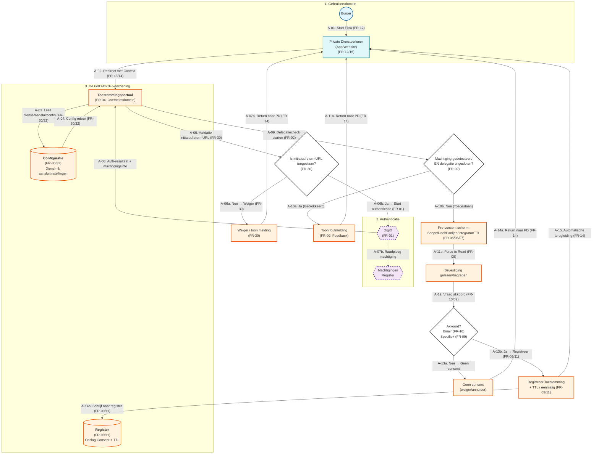

# Flow A - Toestemming geven

## Bron

De flowchart is afkomstig uit het document dat de Functionele Requirements (FR) voor DvTP (Delen via Toestemming met Private partijen) beschrijft als toetsbaar fundament voor ontwerp, realisatie en beheer van de voorzieningen die toestemming door de burger mogelijk maken in de gegevensuitwisseling tussen publieke en private partijen. De set met functionele requirements is gebaseerd op de use cases uit het Beschrijvend document DvTP v0.2.

## Flowchart

