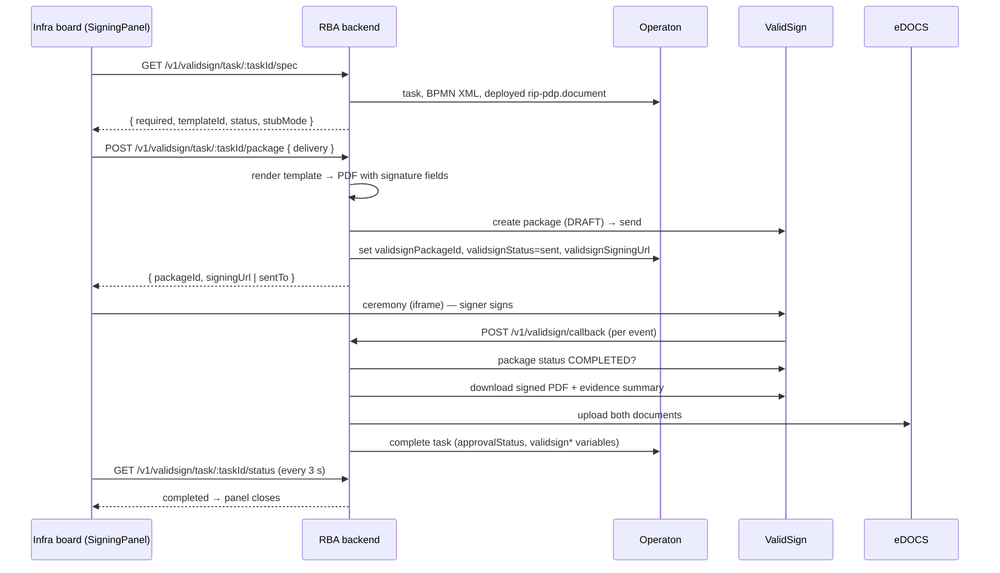

# ValidSign — digital signing of RIP phase-exit approvals

The infra board lets the person who claims a RIP phase-exit approval sign the
approval document digitally, through ValidSign (the EU-branded OneSpan Sign
platform the province is licensed for). The signature completes the Operaton
task, records the outcome on the process, and archives the signed PDF and
ValidSign's evidence summary in eDOCS.

This page describes the feature as built and as verified on ACC on
14 September 2026. The design rationale is in
[the design spec](superpowers/specs/2026-08-25-validsign-phase-approval-signing-design.md);
the steps to switch production to live signing are in
[VALIDSIGN-PROD-TODO.md](VALIDSIGN-PROD-TODO.md).

| Environment | Mode                                    | Verified                                                                               |
| ----------- | --------------------------------------- | -------------------------------------------------------------------------------------- |
| Local       | per `packages/backend/.env.development` | live signing works; completion always by the poller (ValidSign cannot reach localhost) |
| ACC         | **live** since 2026-09-14               | real ceremony signed; callbacks accepted; evidence email received                      |
| PROD        | stub (no `VALIDSIGN_*` settings)        | not live — see the to-do list                                                          |

---

## 1. What the signer sees

1. A user task that carries `ronl:signatureRef` in its BPMN shows a signing
   panel instead of its form: _"Deze taak vereist een digitale handtekening."_
   Today that is only `Task_AccorderenProjectplan4` (R2.1, _Accorderen
   Projectplan 4. Uitgangspunten VO-fase_), which signs the `rip-pdp` document.
2. The signer claims the task, then chooses:
   - **Onderteken nu** — the ValidSign ceremony opens embedded in the panel.
   - **Stuur per e-mail** — ValidSign emails the signing request to the
     signer's own address, for signing elsewhere (typically a phone).
3. After signing, the ceremony shows ValidSign's own confirmation, with a
   **Terug naar het infrabord** button when the board's public URL is known.
4. The panel polls every 3 seconds and closes itself when the task completes.
   The task is completed by the **backend**, not by the browser.
5. Declining in the ceremony records `approvalStatus=rejected` and the process
   follows the "niet akkoord" path.

The signer's identity is taken from their Keycloak token — `email`,
`given_name`, `family_name` — never from the request. **A user without an
email claim cannot sign**: the panel says so and offers no retry, because only
an administrator can fix the account.

## 2. How it fits together



| Part             | Where                                                                                                | Role                                                                               |
| ---------------- | ---------------------------------------------------------------------------------------------------- | ---------------------------------------------------------------------------------- |
| BPMN tag         | `ronl:signatureRef="rip-pdp"` on the user task, in LDE's `e2e-fixtures/flevoland/RipR21Process.bpmn` | the only switch that makes a task signature-bearing                                |
| Spec resolution  | `operatonService.getTaskSignatureSpec`                                                               | reads the attribute from **that** task and loads the deployed `.document` template |
| Rendering        | `renderTemplate` + `toPdf` (`services/document/`)                                                    | template zones + process variables → PDF with placed signature lines               |
| ValidSign client | [`validsign.service.ts`](../packages/backend/src/services/validsign.service.ts)                      | REST client (no Node SDK exists); stub or live                                     |
| Routes           | [`validsign.routes.ts`](../packages/backend/src/routes/validsign.routes.ts)                          | board endpoints (JWT) and the unauthenticated callback / ceremony routes           |
| Completion       | [`validsignCompletion.service.ts`](../packages/backend/src/services/validsignCompletion.service.ts)  | one idempotent path used by both callback and poller                               |
| Poller           | [`validsignPoller.service.ts`](../packages/backend/src/services/validsignPoller.service.ts)          | safety net: sweeps instances with `validsignStatus=sent`                           |
| Panel            | [`SigningPanel.tsx`](../packages/frontend/src/components/InfraBoardDashboard/SigningPanel.tsx)       | claim → sign → poll; resumes an in-flight package after a reload                   |

## 3. The flow in detail

### Creating the package — `POST /v1/validsign/task/:taskId/package`

- **Refuses** with `422 MISSING_SIGNER_EMAIL` when the token has no email,
  `404 NOT_SIGNATURE_TASK` when the task carries no `ronl:signatureRef`,
  `400 INVALID_DELIVERY` for a delivery other than `embedded` / `email`, and
  `409 VALIDSIGN_PACKAGE_EXISTS` when `validsignStatus` is already `sent`,
  `completed` or `declined`. A sent request cannot be recalled, so the guard
  runs **before** anything is rendered or created.
- **Package** (live): `language: nl`, an **explicit sender**
  (`VALIDSIGN_SENDER_EMAIL`, or the signer when unset — the API key is
  account-wide, so a default owner must never be relied on), one signer role,
  one document with `extract: false` and signature fields placed from the PDF's
  own coordinates (72-DPI points scaled to ValidSign's 96-DPI pixels, derived
  from live signatures on 30 August 2026).
- **Hand-over**: `settings.ceremony.handOver` points at
  `<first CORS_ORIGIN>/dashboard/infra-board`, with `autoRedirect: false`. It is
  omitted when that origin is loopback or private — the signer's browser would
  refuse the navigation — and ValidSign's account default (the province website)
  applies instead.
- **Process variables written**: `validsignPackageId`, `validsignStatus=sent`,
  and for embedded delivery `validsignSigningUrl`. If no embedded URL can be
  fetched the request still succeeds and reports `sentTo` (email fallback).

The package's **name** is the document template's own `name` —
_"RIP — Preliminary Design Principles (Column 4)"_ for `rip-pdp`. The RIP
document names are English on purpose (they also name the eDOCS documents);
Dutch labels exist only for on-screen use (`rip-swimlane/doc-label.ts`).

### Completing — `completeSignature(packageId)`

Called by the callback for every event and by the poller for every waiting
instance. It is a no-op unless there is something to do:

1. One run per package at a time (in-process lock); a concurrent call returns
   `noop`.
2. Unknown package, or the instance already `completed` / `declined` → `noop`.
3. Asks ValidSign for the package status; anything other than `COMPLETED` or
   `DECLINED` → `noop`. This is why the early callback events
   (`PACKAGE_CREATE`, `DOCUMENT_VIEWED`, …) change nothing.
4. On `COMPLETED`: downloads the signed PDF and the evidence summary and uploads
   both to eDOCS as standalone documents (department `EDOCS_DEPARTMENT`,
   default `IVR`), named `<projectNumber> — Uitgangspunten VO-fase (ondertekend) — getekend document`
   and `… — bewijsoverzicht`. **An archive failure does not block the task**:
   the signature is legally complete at ValidSign, so the task completes with
   `validsignArchiveStatus=failed`.
5. Completes the Operaton task in **one** write with `approvalStatus`
   (`approved` / `rejected`), `validsignStatus`, `validsignSignedAt`,
   `validsignArchiveStatus`, and on success `validsignSignedDocNumber` /
   `validsignSignedDocId`.

### Process variables

| Variable                                           | Written by                     | Values                                      |
| -------------------------------------------------- | ------------------------------ | ------------------------------------------- |
| `validsignPackageId`                               | package route                  | ValidSign package (transaction) id          |
| `validsignStatus`                                  | package route, completion      | `sent`, `completed`, `declined`             |
| `validsignSigningUrl`                              | package route (embedded)       | ceremony URL                                |
| `validsignSignedAt`                                | completion                     | ISO timestamp                               |
| `validsignArchiveStatus`                           | completion                     | `ok`, `failed`                              |
| `validsignSignedDocNumber`, `validsignSignedDocId` | completion (archive succeeded) | eDOCS identifiers of the signed PDF         |
| `approvalStatus`                                   | completion                     | `approved`, `rejected` — drives the gateway |

## 4. HTTP routes

| Route                                              | Auth                   | Purpose                                                                        |
| -------------------------------------------------- | ---------------------- | ------------------------------------------------------------------------------ |
| `GET /v1/validsign/task/:taskId/spec`              | JWT + tenant           | is this task signature-bearing; current status; `stubMode`                     |
| `POST /v1/validsign/task/:taskId/package`          | JWT + tenant           | create and send the package                                                    |
| `GET /v1/validsign/task/:taskId/status`            | JWT + tenant           | status for the panel; falls back to Operaton **history** once the task is gone |
| `POST /v1/validsign/callback`                      | shared secret (see §5) | ValidSign's event webhook                                                      |
| `GET /v1/validsign/stub/ceremony/:packageId`       | none — capability URL  | stand-in ceremony page; **404 in live mode**                                   |
| `POST /v1/validsign/stub/ceremony/:packageId/sign` | none — capability URL  | stand-in sign / decline; **404 in live mode**                                  |
| `GET /v1/validsign/ceremony/complete`              | none                   | backend landing page; kept, not currently the hand-over target                 |

The callback and ceremony routes are mounted before `jwtMiddleware`: ValidSign
and an iframe navigation cannot carry a Keycloak token. Stub package ids are
random UUIDs, so a stub ceremony URL is unguessable.

## 5. The callback

ValidSign posts one callback per package event. For the ACC test signing on
14 September 2026 these arrived within 12 seconds: `PACKAGE_CREATE`,
`PACKAGE_ACTIVATE`, `DOCUMENT_VIEWED`, `DOCUMENT_SIGNED`, `PACKAGE_COMPLETE`,
`SIGNER_COMPLETE`. The task completed 1.2 s after `PACKAGE_COMPLETE`.

**Authentication.** The callback key must equal `VALIDSIGN_CALLBACK_SECRET`,
compared in constant time. Accepted forms, and the `credential` value logged
with _"ValidSign callback received"_:

| Header                                  | `credential`                                             |
| --------------------------------------- | -------------------------------------------------------- |
| `Authorization: Basic <key>`            | `basic-raw` — **what ValidSign sends** (observed on ACC) |
| `Authorization: Basic base64(<key>)`    | `basic-base64`                                           |
| `Authorization: Basic base64(name:key)` | `basic-base64-pair`                                      |
| `Authorization: Bearer <key>`           | `bearer`                                                 |
| `x-validsign-secret: <key>`             | `x-validsign-secret`                                     |

ValidSign's handler is registered with security type _"Bearer token"_, yet it
sends `Basic` with the raw key. #131 added Bearer; the first logged live
callbacks were all rejected as `authorization:Basic`; #132 accepted every Basic
form that still requires the key and logged which one matched. Only
`basic-raw` has been seen, so the other Basic forms can be removed (see the
to-do list).

**Behaviour.**

- A rejection is **401** and logs _"ValidSign callback rejected: bad shared
  secret"_ with `presented` — header names and the Authorization scheme only,
  e.g. `authorization:Basic`; a scheme-less value logs as
  `authorization:(no scheme)`. The key is never logged.
- An accepted callback always answers **200**, including for an unknown
  package or a failed completion: a 5xx would make ValidSign retry, and the
  response must not reveal which package ids exist. The poller retries a failed
  completion.
- Its own rate limit: 60 requests per minute per client IP, separate from the
  app-wide limiter, which skips this path.
- Its own body parser, capped at 16 kB: a malformed or oversized body is
  **400**, never 500.
- **Nothing is lost when a callback fails.** The poller checks every
  `VALIDSIGN_POLL_INTERVAL_MS` (default 15 s) and completes the task through the
  same path. Signing works without callbacks, just up to 15 s slower.

## 6. Stub mode and the live-signing locks

The licence is **production-only — there is no sandbox** — and the API key is
the **account key** for Provincie Flevoland: it can read and act on every
package in the account, including colleagues' signed contracts. So live calls
sit behind three locks, checked before anything reaches the network:

1. `VALIDSIGN_STUB_MODE=false` (the default is `true`);
2. a non-empty `VALIDSIGN_API_KEY`;
3. `DEPLOYMENT_ENV` listed in `VALIDSIGN_LIVE_TIERS` (empty by default — no
   tier may sign live until named).

With stub mode off, the backend **refuses to start** when the API key, the
callback secret or the tier is missing (`validateConfig()` throws on import).
So a healthy start after switching to live is proof the configuration is
complete.

In stub mode every method returns realistic fake data, the ceremony is served
by the backend itself, and the signed "document" is a real, openable PDF
marked _Stub-ondertekening_. The R2.1 E2E journey refuses to sign unless the
backend reports `stubMode: true`.

## 7. Configuration

### Backend (App Service settings / `.env.development`)

| Setting                      | Default                       | Notes                                                                                                    |
| ---------------------------- | ----------------------------- | -------------------------------------------------------------------------------------------------------- |
| `VALIDSIGN_STUB_MODE`        | `true`                        | `false` for live signing                                                                                 |
| `VALIDSIGN_LIVE_TIERS`       | empty                         | comma-separated `DEPLOYMENT_ENV` values allowed to sign live (`development`, `acceptance`, `production`) |
| `VALIDSIGN_API_KEY`          | empty                         | account key from ValidSign → API Access; sent verbatim as `Authorization: Basic <key>`. Secret.          |
| `VALIDSIGN_CALLBACK_SECRET`  | empty                         | must equal the callback key registered with ValidSign. Secret.                                           |
| `VALIDSIGN_SENDER_EMAIL`     | empty → the signer            | package sender                                                                                           |
| `VALIDSIGN_BASE_URL`         | `https://my.validsign.eu/api` | leave unset                                                                                              |
| `VALIDSIGN_POLL_INTERVAL_MS` | `15000`                       | leave unset on Azure; lower (e.g. `3000`) locally                                                        |

Related: `DEPLOYMENT_ENV` (the tier the allowlist is matched against — **not**
`NODE_ENV`, which is `production` on ACC too), `CORS_ORIGIN` (its **first**
entry is the board URL for the ceremony hand-over and for iframe
`frame-ancestors`), `EDOCS_STUB_MODE` and `EDOCS_DEPARTMENT` (where the signed
PDF is archived).

### ValidSign side — the callback handler

Registered with ValidSign by the Flevoland organisation, not read by the
backend. The values agreed for ACC:

| Field                  | ACC value                                              |
| ---------------------- | ------------------------------------------------------ |
| API name               | `RONL Business API — ACC`                              |
| Origin key             | `ronl-business-api`                                    |
| Environment            | `Productie`                                            |
| Callback URL           | `https://acc.api.open-regels.nl/v1/validsign/callback` |
| Callback security type | `Bearer token` (sends `Basic <key>` in practice)       |
| Callback key           | test value agreed with Flevoland — **to be rotated**   |

Locally these are kept for reference in `packages/backend/.env.development` as
`VALIDSIGN_API_NAME`, `…_ORIGIN_KEY`, `…_ENVIRONMENT`, `…_CALLBACK_URL`,
`…_CALLBACK_SECURITY_TYPE` and `…_CALLBACK_KEY`. Note that locally
`VALIDSIGN_CALLBACK_SECRET` and `VALIDSIGN_CALLBACK_KEY` hold different values;
an environment's `VALIDSIGN_CALLBACK_SECRET` must be the **registered key**.

### Keycloak

The `ronl-business-api` client needs the `email`, `given_name` and
`family_name` protocol mappers (`scripts/keycloak-add-token-claim-mappers.sh`),
and every signer needs an email address on their account.

## 8. Operating it

### Confirm live mode after a deploy or settings change

The startup log line _"ValidSign service initialised"_ carries `stubMode`,
`deploymentEnv` and `liveTiers`. App Service container logging must be on
(it is, on ACC and PROD). The app log is `/home/LogFiles/*_default_docker.log`,
readable through Kudu with an Entra ID token:

```bash
APP=ronl-business-api-acc
TOKEN=$(az account get-access-token --resource https://management.azure.com/ --query accessToken -o tsv)
SCM=https://$APP.scm.azurewebsites.net
curl -s -H "Authorization: Bearer $TOKEN" "$SCM/api/vfs/LogFiles/" | jq -r '.[].name' | grep default_docker
curl -s -H "Authorization: Bearer $TOKEN" "$SCM/api/vfs/LogFiles/<file>" \
  | grep -E 'ValidSign service initialised|ValidSign callback|Signature completed'
```

`az webapp log tail` shows nothing while container logging is off.

### Test a signing on ACC

Drive an R2.1 project to the approval task with
[`scripts/rip-r21-to-approval.sh`](../scripts/rip-r21-to-approval.sh)
(see [RIP-WALKTHROUGH-SCRIPTS.md](RIP-WALKTHROUGH-SCRIPTS.md)):

```bash
BACKEND_URL=https://acc.api.open-regels.nl \
KEYCLOAK_URL=https://acc.keycloak.open-regels.nl \
OPERATON_URL=https://operaton.open-regels.nl/engine-rest \
START_USER=test-infra-flevoland START_PASSWORD='<acc password>' \
  bash scripts/rip-r21-to-approval.sh
```

Then claim the task on the ACC board and sign. In the log, expect _"ValidSign
package created"_, six _"ValidSign callback received"_ lines with
`credential: basic-raw`, and _"Signature completed"_. ValidSign emails an
evidence notice with the transaction id — it equals `validsignPackageId`.

**Every live test creates a real package** on the production account and uses
signing quota.

### Rotate the callback key

1. Agree the new key with Flevoland and register it in ValidSign's callback
   handler.
2. Set `VALIDSIGN_CALLBACK_SECRET` to the same value on the environment (one
   `az webapp config appsettings set`; the app restarts).
3. Sign once and confirm _"ValidSign callback received"_. Until both sides
   match, callbacks are rejected and the poller completes signatures.

### Roll back

- **Back to stub on an environment**: set `VALIDSIGN_STUB_MODE=true` (restart).
  Resolve in-flight live packages first: in stub mode the backend no longer
  talks to ValidSign, so a package sent live will not complete.
- **Remove signing from a task**: delete `ronl:signatureRef` from the task in
  the BPMN and redeploy it. The task falls back to its `rip-approval` form. No
  data migration, no code change.

## 9. Known limitations and open points

- **The duplicate-package guard is not atomic.** Two truly simultaneous create
  requests can both pass it. The panel removes the button on first click and
  withholds it once a package exists; what remains needs concurrent requests
  from separate tabs.
- **The API key is account-wide and tied to a personal account.** Long term the
  integration should use a dedicated integration sender and key rather than a
  person's account.
- **One signer**, whoever claims the task. No external signers, reminders or
  escalation.
- **Only `Task_AccorderenProjectplan4` is wired.** The mechanism supports every
  phase; tagging another task is a BPMN change.
- **Package names are English** (the template name). A Dutch ValidSign-only name
  is possible without renaming eDOCS documents.
- **eDOCS is stubbed on ACC and PROD** (`EDOCS_STUB_MODE=true`), so the signed
  PDF is archived to the stub there. The real document is in ValidSign.
- **Locally, callbacks never arrive**; the poller completes every signature.

## 10. History

| When                | Change                                                                                                             |
| ------------------- | ------------------------------------------------------------------------------------------------------------------ |
| 2026.08.36 (30 Aug) | Feature shipped: tag-driven signing, stub mode, live-tier allowlist, callback plus poller, placed signature fields |
| #131 (14 Sep)       | Callback accepts `Authorization: Bearer`; rejections log the presented credential form                             |
| #132 (14 Sep)       | Callback accepts `Authorization: Basic` (raw, base64, base64 pair); accepted callbacks log the form                |
| 14 Sep              | ACC switched to live: five App Service settings, container logging enabled; first live signings verified           |
