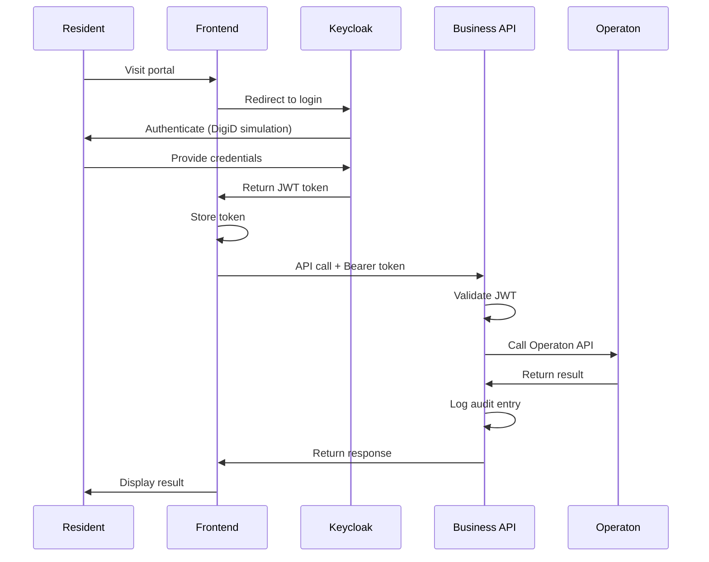
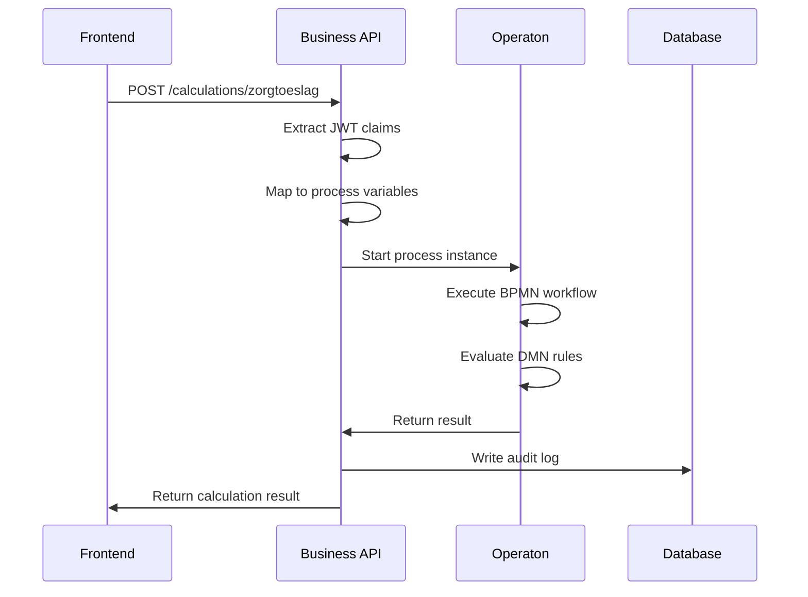

# Architecture Overview

## The Business API Layer Pattern

RONL Business API implements the **Business API Layer** pattern for government digital services. This pattern provides a secure, audited interface between municipality IAM systems and the Operaton BPMN engine.

### The Challenge

Dutch municipalities need to offer digital services to residents with:

- **DigiD/eIDAS/eHerkenning** authentication (government-grade security)
- **Multi-tenancy**: Each municipality has its own users, data, and branding
- **Compliance**: BIO, NEN 7510, AVG/GDPR requirements
- **Audit logging**: Complete trail of all actions
- **High reliability**: Comparable to government services

### The Classical Integration Pattern

```
Resident
   ↓
Municipality Frontend (MijnOmgeving / Portaal)
   ↓ (DigiD, eIDAS, eHerkenning)
IAM / Access Gateway (Keycloak)
   ↓ (OIDC / JWT / signed claims)
Business API Layer (RONL Backend)
   ↓ (REST / events)
Operaton BPMN Engine
```

The **Business API Layer** sits between the IAM and the BPMN engine, handling all security and business logic.

## What is the Business API Layer?

The Business API Layer is **not** Operaton's native REST API. It's a custom service that provides:

### Core Responsibilities

1. **Token Validation**
   - Validates OIDC/JWT tokens from Keycloak
   - Verifies token signature using JWKS
   - Checks token expiration and audience

2. **Claims Mapping**
   - Converts JWT claims into process variables
   - Maps `sub` → `userId`
   - Maps custom claims → `municipality`, `roles`, `loa` (Level of Assurance)

3. **Authorization**
   - Enforces per-municipality access rules
   - Validates user roles for process actions
   - Checks mandate/representation rights

4. **Tenant Isolation**
   - Ensures municipalities can't access each other's data
   - Filters process instances by municipality
   - Isolates audit logs per tenant

5. **Process Invocation**
   - Calls Operaton REST API securely
   - Injects user context as process variables
   - Handles process lifecycle

6. **Audit Logging**
   - Records all API calls with user context
   - Compliance-grade logs (who, what, when, why)
   - Tamper-evident logging

7. **API Simplification**
   - Clean, versioned REST endpoints
   - Municipality-friendly operations
   - Hides BPMN complexity

### Example Flow: Zorgtoeslag Calculation

```
1. Resident logs into Utrecht portal
   ↓
2. Frontend redirects to Keycloak
   ↓
3. Keycloak authenticates (simulates DigiD)
   ↓
4. Keycloak issues JWT:
   {
     "sub": "user-uuid",
     "municipality": "utrecht",
     "roles": ["citizen"],
     "loa": "substantial"
   }
   ↓
5. Frontend calls Business API:
   POST /v1/calculations/zorgtoeslag
   Authorization: Bearer <JWT>
   {
     "income": 24000,
     "age": 25,
     "healthInsurance": true
   }
   ↓
6. Business API validates JWT
   ↓
7. Maps claims to process variables:
   {
     "initiator": "user-uuid",
     "municipality": "utrecht",
     "input": {
       "ingezeteneVanNederland": true,
       "18JaarOfOuder": true,
       "zorgverzekeringInNederland": true,
       "inkomenEnVermogen": 24000
     }
   }
   ↓
8. Calls Operaton:
   POST /process-definition/key/zorgtoeslag/start
   ↓
9. Operaton executes BPMN/DMN
   ↓
10. Returns result (eligible: true, amount: 1150)
   ↓
11. Business API logs action
   ↓
12. Returns to frontend:
   {
     "processInstanceId": "abc-123",
     "result": {
       "eligible": true,
       "amount": 1150
     }
   }
```

## Architecture Components

### Frontend (React SPA)

- **Purpose**: Municipality-branded user interface
- **Location**: Azure Static Web Apps
- **Responsibilities**:
  - Multi-tenant branding (Utrecht, Amsterdam, etc.)
  - OIDC login flow with Keycloak
  - Form submission and result display
  - JWT token management

### Business API (Node.js Backend)

- **Purpose**: Security and business logic layer
- **Location**: Azure App Service
- **Responsibilities**:
  - JWT validation and claims extraction
  - Authorization enforcement
  - Operaton API integration
  - Audit logging
  - Multi-tenant data isolation

### Keycloak (IAM)

- **Purpose**: Identity and Access Management
- **Location**: VM (open-regels.nl)
- **Responsibilities**:
  - User authentication
  - Federation with DigiD/eIDAS/eHerkenning (simulated)
  - JWT token issuance with custom claims
  - User and role management per municipality

### Operaton (BPMN Engine)

- **Purpose**: Business rules execution
- **Location**: VM (open-regels.nl)
- **Responsibilities**:
  - Execute BPMN workflows
  - Evaluate DMN decision tables
  - Process orchestration
  - Business rule versioning

### PostgreSQL (Audit Database)

- **Purpose**: Audit trail and application data
- **Location**: Azure PostgreSQL Flexible Server
- **Responsibilities**:
  - Store audit logs
  - Track process executions
  - Compliance reporting

### Redis (Cache)

- **Purpose**: Session and token caching
- **Location**: Azure Cache for Redis
- **Responsibilities**:
  - Cache JWKS keys
  - Session management
  - Rate limiting

## Why Not Expose Operaton Directly?

You might ask: "Why not just expose Operaton's REST API directly?"

### Problems with Direct Exposure

❌ **No Multi-Tenancy**: Operaton doesn't understand municipalities  
❌ **No JWT Validation**: Can't validate DigiD/eIDAS tokens  
❌ **Complex API**: Too technical for municipality developers  
❌ **No Audit Logging**: Missing compliance-grade logs  
❌ **Security Risk**: Direct database access potential  
❌ **No Claims Mapping**: Can't convert JWT → process variables

### Benefits of Business API Layer

✅ **Security**: All authentication happens before Operaton  
✅ **Simplicity**: Clean, municipality-friendly API  
✅ **Compliance**: Full audit trail  
✅ **Multi-Tenancy**: Built-in tenant isolation  
✅ **Flexibility**: Easy to add new municipalities  
✅ **Abstraction**: Can change BPMN engine without affecting municipalities

## Key Design Principles

### 1. Security First

- Operaton **never** sees raw DigiD credentials
- All requests validated with JWT
- Least privilege principle
- Defense in depth

### 2. Compliance by Design

- Complete audit trail
- Tamper-evident logging
- GDPR-compliant data handling
- BIO/NEN 7510 compatible

### 3. Multi-Tenant Isolation

- Logical tenant separation (not physical)
- Municipality can't access other's data
- Shared infrastructure, isolated data
- Per-tenant audit logs

### 4. Scalability

- Stateless Business API (horizontal scaling)
- Caching layer (Redis)
- Async processing capability (future)
- CDN for frontend

### 5. Developer Friendly

- Clean REST API
- OpenAPI documentation
- Predictable endpoints
- Helpful error messages

## Data Flow

### Authentication Flow



### Process Execution Flow



## Comparison: With vs Without Business API Layer

### Without Business API Layer (❌ Not Recommended)

```
Frontend → Operaton REST API directly
```

**Problems:**

- Frontend needs to handle complex BPMN API
- No central authentication point
- No audit logging
- No multi-tenancy
- Security risks
- Compliance issues

### With Business API Layer (✅ Recommended)

```
Frontend → Business API → Operaton
```

**Benefits:**

- Simple REST API for frontend
- Central authentication & authorization
- Complete audit trail
- Multi-tenant isolation
- Security enforced
- Compliance ready

## Open Source Components

RONL uses 100% open source components:

| Component      | Purpose            | License            |
| -------------- | ------------------ | ------------------ |
| **Keycloak**   | IAM Federation     | Apache 2.0         |
| **Operaton**   | BPMN/DMN Engine    | Apache 2.0         |
| **Node.js**    | Backend Runtime    | MIT                |
| **Express**    | Web Framework      | MIT                |
| **React**      | Frontend Framework | MIT                |
| **PostgreSQL** | Database           | PostgreSQL License |
| **Redis**      | Cache              | BSD 3-Clause       |
| **Caddy**      | Reverse Proxy      | Apache 2.0         |

No proprietary software required!

## Scalability Considerations

### Current Scale

- **Users**: ~100-1000 per municipality
- **Processes**: ~100-500/day
- **Municipalities**: 4 (Utrecht, Amsterdam, Rotterdam, Den Haag)

### Future Scale

- **Users**: Unlimited (horizontal scaling)
- **Processes**: 10,000+/day
- **Municipalities**: 355 (all Dutch municipalities)

### Scaling Strategy

**Frontend**: Already on CDN (Azure Static Web Apps)  
**Business API**: Azure App Service (auto-scaling)  
**Keycloak**: Can cluster (add more VM instances)  
**Operaton**: Can cluster (shared database)  
**Database**: Azure managed scaling

## Next Steps

- [Deployment Architecture](deployment.md) - Learn about VM vs Azure split
- [Security Architecture](security.md) - Deep dive into authentication
- [Backend Development](../development/backend.md) - Build the Business API
- [Frontend Development](../development/frontend.md) - Build the portal

---

**The Business API Layer is the key to secure, compliant, multi-tenant government services.** 🎯
