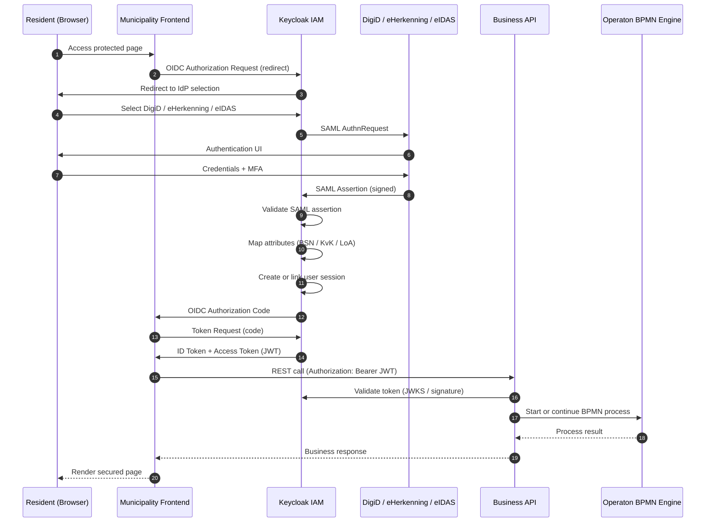

# DigiD → Keycloak → Business API → Operaton

## Authentication & Authorization Sequence Diagram

This document provides a **handover-ready sequence diagram** that aligns with:

- The architecture flow
- The polished UI mockups
- The Keycloak IdP & flow configuration

It is intended for **vendors, IAM engineers, and integration partners**.

---

## 1. Scope & Assumptions

- DigiD / eHerkenning / eIDAS are integrated via **Keycloak IdP brokering**
- Municipality Frontend uses **OIDC Authorization Code Flow**
- Business API validates **JWT access tokens**
- Operaton BPMN engine trusts the Business API security context

---

## 2. High-Level Sequence Diagram



---

## 3. Detailed Step Explanation

### Step 1–3: Frontend → Keycloak

- User accesses a protected route
- Frontend redirects to Keycloak using OIDC
- Keycloak determines external IdP based on request or user choice

---

### Step 4–7: External Identity Provider

- Keycloak sends SAML AuthnRequest
- User authenticates with DigiD / eHerkenning / eIDAS
- MFA and assurance checks happen at the IdP
- Signed SAML assertion is returned to Keycloak

---

### Step 8–11: Keycloak Token Issuance

- Assertion signature validated
- BSN / KvK / LoA attributes mapped
- User is auto-created or linked
- OIDC tokens are issued to frontend

---

### Step 12–15: API & BPMN Execution

- Frontend calls Business API with JWT
- Business API validates signature & claims
- BPMN process is started or resumed
- Authorization decisions rely on token context

---

## 4. Token Boundaries (Trust Model)

```text
[DigiD / eIDAS]
        ↓  (SAML assertion – trust boundary)
[Keycloak IAM]
        ↓  (OIDC / JWT – internal trust boundary)
[Municipality Frontend]
        ↓  (JWT – service trust boundary)
[Business API]
        ↓
[Operaton BPMN]
```

---

## 5. Error & Exception Paths (Recommended)

| Scenario          | Handling                             |
| ----------------- | ------------------------------------ |
| LoA too low       | Keycloak blocks login or API rejects |
| Missing BSN       | First Broker Login aborts            |
| Token expired     | Frontend re-initiates OIDC flow      |
| BPMN auth failure | API returns 403                      |

---

## 6. Vendor Implementation Notes

- Do **not** bypass Keycloak for IdP calls
- Keep DigiD integration SAML-only unless contract allows OIDC
- Validate JWT **aud**, **iss**, and **exp**
- BPMN engine must never be publicly exposed

---

## 7. Deliverable Summary

This sequence diagram, together with:

- UI mockups
- Keycloak IdP configuration
- Attribute & role mapping

forms a **complete, vendor-ready IAM integration package**.

---

**Status:** Final  
**Audience:** External implementation partner  
**Confidence level:** High (architecture-aligned, compliance-aware)
