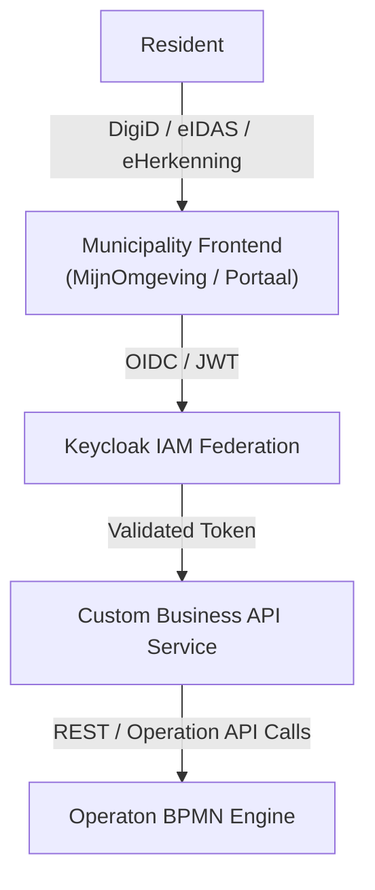

# DigiD → Keycloak Login Mockup (Conceptual Demo)

This document provides a **conceptual UI mockup and flow explanation** for demonstrating
how a Dutch government user (Resident) logs in using **DigiD / eIDAS / eHerkenning**
via **Keycloak as an IAM federation layer**.

This is intended for **architecture demos, documentation, and presentations** —
not as an official DigiD UI.

---

## 1. High-Level Authentication Flow



---

## 2. Municipality Frontend – Login Choice Screen

**Purpose:**  
This screen is owned by the Municipality Portal and offers identity providers.
The user has not yet reached Keycloak.

```text
+----------------------------------------------------+
|  Municipality Portal – MijnOmgeving                |
|----------------------------------------------------|
|                                                    |
|  Welcome                                           |
|                                                    |
|  Choose how you want to log in:                    |
|                                                    |
|  [ 🔐 Login with DigiD ]                            |
|  [ 🏢 Login with eHerkenning ]                      |
|  [ 🇪🇺 Login with eIDAS ]                           |
|                                                    |
|  By continuing you will be redirected securely.   |
|                                                    |
+----------------------------------------------------+
```

**Notes**

- Buttons redirect to **Keycloak OIDC endpoints**
- Each button maps to a **Keycloak Identity Provider**
- Styling must follow Logius branding rules in real systems

---

## 3. Keycloak – Identity Broker Login Page

**Purpose:**  
Keycloak acts as the federation hub and brokers authentication to DigiD/eIDAS.

```text
+----------------------------------------------------+
|  Keycloak Identity & Access Management             |
|----------------------------------------------------|
|                                                    |
|  Municipality IAM                                  |
|                                                    |
|  You are logging in using: DigiD                   |
|                                                    |
|  Redirecting to external identity provider...      |
|                                                    |
|  [ Continue ]                                      |
|                                                    |
+----------------------------------------------------+
```

**Keycloak Configuration**

- Identity Provider: `DigiD (OIDC/SAML)`
- Flow: Redirect-based authentication
- No local password stored in Keycloak

---

## 4. External Identity Provider (Conceptual)

> ⚠️ For demo purposes only – **do not replicate DigiD UI exactly**

```text
+----------------------------------------------------+
|  DigiD – Secure Login                              |
|----------------------------------------------------|
|                                                    |
|  Username:  [ ************ ]                       |
|  Password:  [ ************ ]                       |
|                                                    |
|  [ Login ]                                        |
|                                                    |
|  Two-factor authentication may apply              |
|                                                    |
+----------------------------------------------------+
```

After successful authentication, DigiD redirects back to **Keycloak**.

---

## 5. Keycloak – Token Issuance

```text
+----------------------------------------------------+
|  Keycloak                                          |
|----------------------------------------------------|
| ✔ Identity verified                                |
| ✔ Attributes mapped                                |
| ✔ Session created                                  |
|                                                    |
| Issuing OIDC tokens:                               |
| - ID Token                                         |
| - Access Token (JWT)                               |
|                                                    |
+----------------------------------------------------+
```

**Example Claims**

```json
{
  "sub": "digid-opaque-id",
  "bsn": "*********",
  "iss": "https://keycloak.municipality.nl",
  "aud": "municipality-frontend",
  "loa": "substantial"
}
```

---

## 6. Business API & Operaton BPMN

```text
Municipality Frontend
        ↓  (JWT)
Business API
        ↓  (REST / Task API)
Operaton BPMN Engine
```

- JWT validated by Business API
- Roles & attributes drive BPMN authorization
- Operaton executes workflows (permits, cases, services)

---

## 7. What This Mockup Demonstrates

✔ Separation of concerns  
✔ Keycloak as IAM federation hub  
✔ DigiD / eIDAS / eHerkenning abstraction  
✔ Clean OIDC/JWT boundary  
✔ BPMN engine isolation

---

## 8. Disclaimer

This mockup is **not an official DigiD UI**.  
Always follow **Logius and eIDAS compliance guidelines** when implementing real systems.

---

**Author:** Architecture Demo  
**Use case:** Municipality IAM & BPMN integration
