# Caseworker dashboard features

## Personal info of Caseworker

### Caseworker

- is onboarded by HR department
- is member of one team
- holds one or more roles
- is being assigned those roles by IAM department (ie RBAC)
- participates as projectmember in one or more projects

## Features

### Human resources

1. onboarding process
2. offboarding process

## Regular Infraprojects Process (RIP)

### Process

```mermaid
flowchart LR
    QS([Quick Scan Exploration]) --> V[1. Exploration]
    V --> MB([MBVI/PMIRT])
    MB --> R2[R2. Plan Preparation]
    R2 --> R3[R3. Contract Formation]
    R3 --> R4[R4. Tendering]
    R4 --> CB[5. Contract Management]
    CB --> DP[6. Project Sign-off]
    DP --> EIND([End])

    subgraph RIP [Regular Infrastructure Projects Process - RIP]
        QS
        V
        MB
        R2
        R3
        R4
        CB
        DP
        EIND
    end

    TP[Review Process] -.-> V
    KO[Quality Review of Briefs and Memos] <--> R4
    INK[Procurement] <--> R4

    subgraph DF [Definition Phase Documents]
        D1[/Intake Form/]
        D2[/Intake Report/]
        D3[/PSU Report/]
        D4[/Risk Dossier/]
        D5[/Preliminary Design Starting Points/]
    end

    subgraph VO [Preliminary Design Documents]
        P1[/Cables and Pipelines Inventory/]
        P2[/Customer Requirements Inventory/]
        P3[/Framework Permit Application/]
        P4[/Framework Permit Receipt/]
        P5[/Draft Preliminary Design/]
    end

    DF -.-> V
    VO -.-> R2
```

